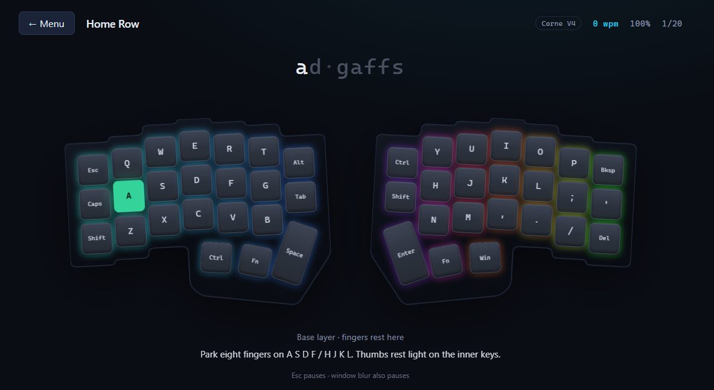

<p align="center">
  
</p>

<h1 align="center">Layer Tutor</h1>

<p align="center">
  <strong>A browser typing trainer for layered QMK / Vial split keyboards.</strong><br />
  Learn base keys first — then the thumb-hold reflexes generic tutors never teach.
</p>

<p align="center">
  <a href="https://layer-tutor.pages.dev"></a>
  &nbsp;
  <a href="https://github.com/thebiglaskowski/layer-tutor/actions/workflows/deploy.yml"></a>
  &nbsp;
  <a href="LICENSE"></a>
</p>

<p align="center">
  
  
  
  
  
  
  
</p>

<p align="center">
  <a href="https://layer-tutor.pages.dev"><strong>Open the live app →</strong></a>
  ·
  <a href="#quick-start">Quick start</a>
  ·
  <a href="#curriculum">Curriculum</a>
  ·
  <a href="#adding-a-keyboard">Add a board</a>
  ·
  <a href="#license">License</a>
</p>

---

## Why this exists

MonkeyType and TypingClub are great for flat QWERTY. They fall over the moment your board needs:

> **hold left Fn → type `4` → release → keep writing**

Layer Tutor is built around *your* Vial matrix. It lights the physical key, the thumb you must hold, and (when needed) Shift — then refuses to advance until the right character lands. Muscle memory, not forgiveness.

**Primary board today**

| | |
|---|---|
| **Product** | CORNE V4 Wired Split Mechanical Keyboard |
| **Form factor** | 40% · 3×6 ortholinear · split |
| **Layers drilled** | Base · Numbers/Nav (left Fn) · Symbols (right Fn) |

Multi-board ready: pick a keyboard in the menu; progress is stored **per board** so a future Iris / Lily58 / custom layout never clobber Corne stats.

---

## Features

<table>
<tr>
<td width="50%" valign="top">

### Training
- **15 progressive stages** from home row → mixed mastery
- **Bigrams**, left/right hand islands, hold drill, pulse drill
- **≥90% accuracy** to unlock the next stage
- **Fluent badge** at ≥90% **and** ≥25 WPM
- Wrong keys flash red; cursor only advances on correct input
- Large pools — replays rarely feel identical

</td>
<td width="50%" valign="top">

### Coaching diagram
- Geometry-driven **split board** (stagger + thumb fan)
- **Base keycaps always visible** (no whole-board legend swap)
- Layer glyphs overlay **only** on the green target
- **HOLD L-FN / HOLD R-FN** and **SHIFT** badges
- Home-row ghost outline, focus mode, collapsible board
- Wrong-key flash on the key you actually hit

</td>
</tr>
<tr>
<td width="50%" valign="top">

### Practice modes
- **Weak-key drill** from your miss heatmap
- **Sandbox** — free type + paste any string
- **Custom word lists** (emails, shell, work jargon)
- Longer **Practice** rounds without unlock side-effects
- **Drill these misses** from the results screen

</td>
<td width="50%" valign="top">

### Progress & polish
- Per-board heatmap + mini keyboard heat view
- Daily streak · “Today” focus card · WPM goals · notes
- Recent-run sparklines · vs-best deltas · coaching line
- Export / import full progress JSON
- First-run onboarding · layer map cheat sheet
- Offline **PWA** · sound toggle · pause on Esc / blur

</td>
</tr>
</table>

---

## Live demo

| | |
|---|---|
| **Production** | [https://layer-tutor.pages.dev](https://layer-tutor.pages.dev) |
| **Install** | Add to Home Screen (Android / desktop Chromium) |
| **Phone + board** | USB-OTG works — portrait stacks the halves |

> Tip: hard-refresh after deploys if a service worker is sticky (`sw.js` cache is version-bumped on releases).

---

## Quick start

```bash
git clone https://github.com/thebiglaskowski/layer-tutor.git
cd layer-tutor/typing-tutor
python3 -m http.server 8000
# → http://localhost:8000
```

A local server is required — native ES modules do not load over `file://`.

```bash
# tests (Node 18+)
node --test tests/*.test.js
node ../scripts/check-layout.mjs   # board matrix ↔ Vial .vil
```

No `npm install`. No bundler. No framework.

---

## Curriculum

Stages unlock in order. Tracks group the menu for scanning.

| # | Stage | Track | What you train |
|---|--------|--------|----------------|
| 1 | Home Row | Base | `asdf` / `hjkl` home |
| 2 | Common Bigrams | Base | `th`, `ing`, `ion`, … |
| 3 | Top Row | Base | Reach up, return home |
| 4 | Bottom Row | Base | Reach down + `, . /` |
| 5 | Left Hand Only | Split | Left island only |
| 6 | Right Hand Only | Split | Right island only |
| 7 | Full Sentences | Base | Both hands, full alphabet |
| 8 | Numbers | Layer 1 | Left Fn + digits |
| 9 | Navigation | Layer 1 | Left Fn + hjkl arrows |
| 10 | Hold Drill | Layer 1 | Sustain left Fn whole token |
| 11 | Symbol Layer | Layer 2 | Right Fn + `!@#$%…` |
| 12 | Brackets & Punctuation | Layer 2 | Right Fn + `-=[]\`…` |
| 13 | Pulse Drill | Mixed | Base ↔ layer every 1–2 chars |
| 14 | Layer Transitions | Mixed | Rapid hold / release mid-token |
| 15 | Mixed Mastery | Mixed | Real-world code & text |

**Legend on the diagram**

| Color | Meaning |
|-------|---------|
| Green | Target key |
| Amber | Hold Fn (layer) |
| Purple | Shift |

---

## Repository layout

```text
layer-tutor/
├── assets/                 # README / marketing images
├── layouts/
│   └── corne-v4.vil        # Vial export (matrix source of truth)
├── typing-tutor/           # PWA (what Cloudflare Pages deploys)
│   ├── index.html
│   ├── style.css
│   ├── sw.js               # offline network-first SW
│   ├── js/
│   │   ├── boards/         # per-keyboard registry + matrices
│   │   ├── gameEngine.js   # pure state machine
│   │   ├── lessons.js      # stages + round builders
│   │   ├── lessonPools*.js # large content pools
│   │   ├── storage.js      # multi-board progress
│   │   ├── keyboardRenderer.js
│   │   ├── ui.js · main.js · sound.js
│   └── tests/              # node:test
├── scripts/
│   ├── check-layout.mjs    # .vil drift check
│   ├── stage-pages.sh      # runtime-only deploy payload
│   ├── deploy-pages.sh
│   └── setup-github-deploy.sh
├── AGENTS.md               # agent / contributor operating guide
├── LICENSE                 # MIT
└── README.md
```

---

## Architecture

Vanilla ES modules. Strict boundaries so pure logic stays unit-tested.

| Module | Responsibility |
|--------|----------------|
| `boards/*` | Board metadata, key matrix, `charToKey`, hold/shift ids |
| `lessons.js` + pools | Curriculum, weak-key / custom rounds, coaching copy |
| `gameEngine.js` | Cursor, mistakes, WPM / accuracy (no DOM) |
| `storage.js` | `localStorage` only — multi-board, streaks, lists, export |
| `keyboardRenderer.js` | Geometry diagram, heatmap paint, focus mode |
| `ui.js` / `main.js` / `sound.js` | Screens, input, orchestration, beeps |

**Hard rules**

- Zero npm runtime dependencies · zero build step  
- DOM only in renderer / UI / main  
- `localStorage` only in `storage.js`  
- Deploy stages **runtime assets only** (no `tests/`)  
- Bump `sw.js` `CACHE` when shipping client changes  

---

## Progress data

Stored under `localStorage` key `qmk-typing-tutor-v1` (name kept for continuity). Document version **4**:

```json
{
  "version": 4,
  "activeBoardId": "corne-v4",
  "onboardingDone": true,
  "boards": {
    "corne-v4": {
      "stages": {
        "home-row": {
          "unlocked": true,
          "bestWpm": 42,
          "bestAccuracy": 96,
          "timesPlayed": 3,
          "fluent": true,
          "recentRuns": [{ "wpm": 40, "accuracy": 95, "at": "…" }],
          "note": "thumb was floating",
          "wpmGoal": 45
        }
      },
      "heatmap": { "a": 4, "[": 2 },
      "streak": { "lastDate": "2026-07-10", "count": 3 },
      "customLists": [],
      "settings": {
        "focusMode": true,
        "showHomeGhost": true,
        "boardCollapsed": false,
        "reducedBoardAuto": true
      }
    }
  }
}
```

Older flat (v1/v2) and multi-board (v3) saves migrate automatically. Export / import from **Settings & data** in the app.

---

## Adding a keyboard

1. Export Vial → `layouts/<id>.vil`
2. Add `typing-tutor/js/boards/<id>.js` using `createLayout()` (copy `corne-v4.js`)
3. Register it in `typing-tutor/js/boards/index.js` (`BOARDS` array)
4. `node scripts/check-layout.mjs` must pass
5. If the physical geometry differs, extend `keyboardRenderer.js`
6. Smoke-test on device (desktop + phone USB-OTG if you care)

**Vial row convention:** each half is stored **outer → inner**. Tutor tables are **visual left → right** — reverse the right half when deriving legends.

Agent-oriented detail: see [`AGENTS.md`](AGENTS.md).

---

## Deploy

Every push to `main` runs tests, then deploys to Cloudflare Pages.

| Piece | Detail |
|-------|--------|
| Workflow | [`.github/workflows/deploy.yml`](.github/workflows/deploy.yml) |
| Project | `layer-tutor` → https://layer-tutor.pages.dev |
| Secrets | `CLOUDFLARE_API_TOKEN`, `CLOUDFLARE_ACCOUNT_ID` |

```bash
# one-time secrets helper
bash scripts/setup-github-deploy.sh

# manual deploy (local wrangler login)
bash scripts/deploy-pages.sh
```

API token needs **Account → Cloudflare Pages → Edit**.

---

## Tech stack

| Layer | Choice |
|-------|--------|
| UI | HTML · CSS custom properties · vanilla ES modules |
| Tests | Node built-in `node:test` + `node:assert` |
| Offline | Service worker (network-first, versioned cache) |
| Hosting | Cloudflare Pages |
| CI | GitHub Actions + Wrangler |
| Layout truth | Vial `.vil` JSON + `check-layout.mjs` |

---

## Contributing

Issues and PRs welcome — especially new board modules and curriculum pools.

Before opening a PR:

```bash
cd typing-tutor
node --test tests/*.test.js
node ../scripts/check-layout.mjs
```

Please keep the **zero-dependency / no-bundler** constraint unless there’s a strong reason to break it.

---

## Acknowledgments

- [QMK](https://qmk.fm/) & [Vial](https://get.vial.today/) for the firmware / config ecosystem  
- The Corne family of splits for making layered thumbs normal  
- Every tutor that taught flat QWERTY and accidentally inspired this one  

---

## License

Distributed under the **MIT License**. See [`LICENSE`](LICENSE) for the full text.

```
Copyright (c) 2026 Joe Laskowski (thebiglaskowski)
```

---

<p align="center">
  <sub>Built for hands that hold a layer key.</sub><br />
  <a href="https://layer-tutor.pages.dev">layer-tutor.pages.dev</a>
</p>
